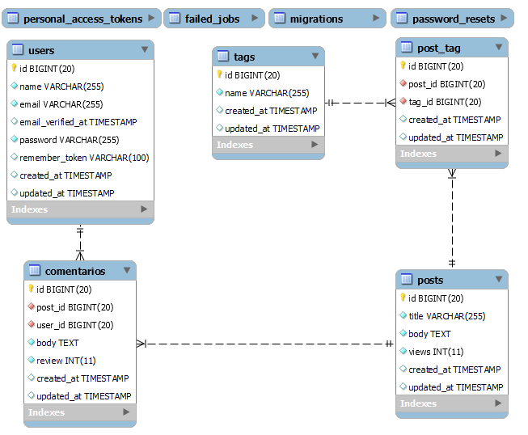

# Avaliação 

### Tecnologias

+ Laravel 8
+ Vue 2.0
+ Bootstrap 4.0
+ PHP ^7.4 | 8.0

### Banco de dados

---

## Objetivos

### Listagem dos Posts na página inicial

A página inicial ([welcome](./resources/views/welcome.blade.php)) possui uma lista onde são exibidos: 
+ Os 3 últimos posts cadastrados;
+ Os 3 posts mais visualizados;
+ As 3 tags que possuem mais visualizações (Soma da visualização dos posts marcados com a tag);

Substituir o código HTML com dados do banco para as 3 listas.

Cada post deve apresentar a lista de tags, quantidade de visualizações, quantidade de comentários

### Visualização dos Posts

Criar uma tela que mostre apenas o título e corpo do Post e a lista de comentários.
Incrementar o atributo "views" da tabela Post ao acessar a url.

### Inscrição de endereços eletrônicos para recebimento de Posts.

O usuário poderá ser inscrever para receber Posts marcados com a tag escolhida

+ Criar uma tabela no banco de dados para armazenar as inscrições cadastradas;
+ Utilizar o formulário no componente [FormSubscription](./resources/js/components/FormSubscription.vue "Componente Vue");
+ Criar o processo de inscrição (rotas, models, controllers, validações, etc.);
+ O formulário deve passar por uma validação no servidor onde:
  + O endereço eletrônico é obrigatório e deve ser válido, sendo permitido apenas uma inscrição por endereço;
  + O campo tag é obrigatório e o ID deve existir no banco;
+ Automatizar o processo de envio da notificação diariamente às 10h da manhã;
+ Os inscritos receberão um link de um post aleatório que possua a tag escolhida por eles no ato da inscrição.

---

## Diferencial

Tarefas adicionais 

### Componente Vue para likes e dislikes no Post

  + Adicionar o campo likes na tabela Post
  + Na tela de visualização do post, inserir um componente vue que utilize as rotas /like e /deslike
  + Ao dar like ou deslike, desabilitar o botão e modificar o estilo (Ex: Deixar azul se deu like e vermelho se for dislike)
  + Mostrar a quantidade de likes do post e incrementar ou decrementar quando o usuário fizer a ação.

### Utilizar eager loading

  + Trazer todos os dados do controller, evitar acessar relacionamentos dentro do blade.

---

## Observações

Rodar o comando abaixo para carregar o banco com dados de teste.

    php artisan migrate --seed

Algumas tarefas estão marcadas no código com **TODO**, podem ser visualizadas utilizando a aba _todos_ do phpstorm ou a extensão [_todo-tree_](https://marketplace.visualstudio.com/items?itemName=Gruntfuggly.todo-tree) do VSCODE
